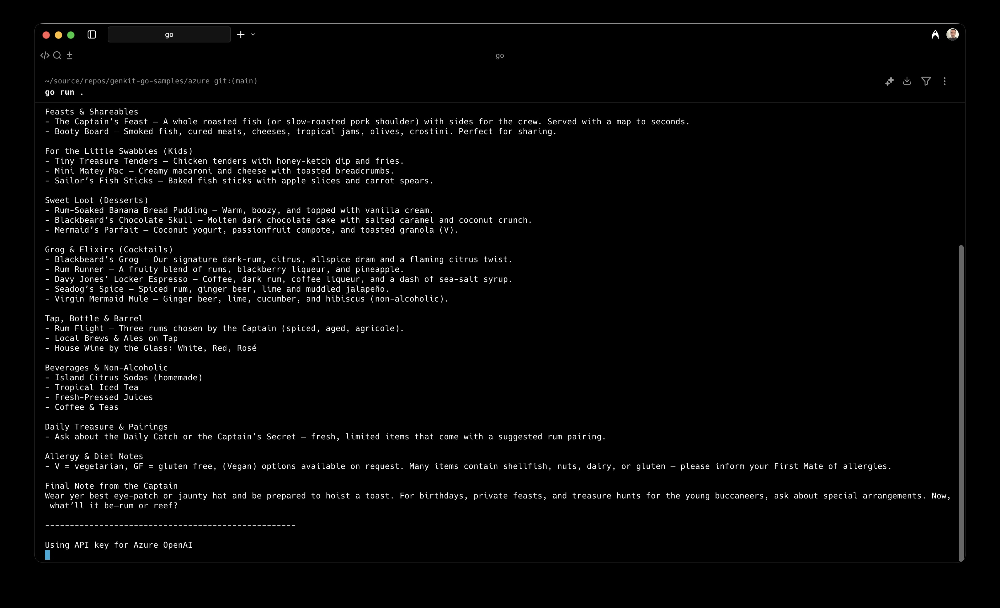

+++
date = '2025-10-24T16:32:31+02:00'
title = 'Building a Genkit Go Plugin for Azure OpenAI'
tags = ['go', 'genkit', 'azure-openai']
series = ['Genkit Go and Azure OpenAI']
series_order = 1
summary = """A few weeks ago, Google announced the general availability of [Genkit Go](https://developers.googleblog.com/en/announcing-genkit-go-10-and-enhanced-ai-assisted-development/), described as Google's open-source AI development framework for the Go ecosystem. In this blog series, I will explain how to use Genkit Go with Azure OpenAI."""
+++

A few weeks ago, Google announced the general availability of [Genkit Go](https://developers.googleblog.com/en/announcing-genkit-go-10-and-enhanced-ai-assisted-development/), described as "Google's open-source AI development framework for the Go ecosystem". While Go AI development frameworks and SDKs from Microsoft, OpenAI, Anthropic, and others have been available for some time, having a major cloud provider release a framework that works across multiple providers deserves attention if you're interested in building AI apps with Go.


This blog post isn't an introduction to Genkit Go. The official documentation already covers that well. If you're new to Genkit Go, check out the [intro article](https://genkit.dev/docs/get-started/?lang=go") on the Genkit website.


Genkit Go includes both an OpenAI plugin and an OpenAI-compatible plugin. But what about Azure OpenAI? In this blog series, I will explain how to use Genkit Go with Azure OpenAI.

## Azure OpenAI vs. OpenAI

If you're new to Azure OpenAI, especially if you know OpenAI, it's worth understanding how they differ. Without differences, this blog post wouldn't exist 😜.

Azure OpenAI is a cloud service that hosts OpenAI models in Azure and adds enterprise capabilities like virtual network integration, Entra-based access control, and content filtering. You can deploy Azure OpenAI in two ways: create an Azure AI Foundry resource and deploy models in your [Azure AI Foundry project](https://learn.microsoft.com/en-us/azure/ai-foundry/how-to/deploy-models-openai), or deploy Azure OpenAI as a standalone Azure resource. If you've never deployed Azure OpenAI, see [this article](https://learn.microsoft.com/en-us/azure/ai-foundry/openai/how-to/create-resource?pivots=web-portal) for an introduction.

For Genkit Go with Azure OpenAI, the deployment method doesn't matter—both offer the same endpoints and API versions. What matters is the specific *API version*.

## Azure OpenAI API Versions

If you've used Azure OpenAI or read the article mentioned above, you've encountered this callout:

---
When you access the model via the API, you need to refer to the deployment name rather than the underlying model name in API calls, which is one of the [**key differences** between OpenAI](https://learn.microsoft.com/en-us/azure/ai-foundry/openai/how-to/switching-endpoints) and Azure OpenAI. OpenAI only requires the model name. Azure OpenAI always requires deployment name, even when using the model parameter.  

---

An important detail: This applies to the [`2024-10-21` API version](https://learn.microsoft.com/en-us/azure/ai-foundry/openai/reference) and its predecessors. For simplicity, I'll refer to these collectively as [`2024-10-21`](https://learn.microsoft.com/en-us/azure/ai-foundry/openai/reference).

Since August 2024, [another API version is available](https://learn.microsoft.com/en-us/azure/ai-foundry/openai/api-version-lifecycle?tabs=python) with the nondescript name `v1`. This version eliminates the differences between Azure OpenAI `2024-10-21` and the standard OpenAI API, including the deployment name requirement. `v1` is fully aligned with standard OpenAI APIs and works with any OpenAI SDK.

This remainder of this post explains how to use Genkit Go with Azure OpenAI `v1`. A future post will cover Azure OpenAI [`2024-10-21`](https://learn.microsoft.com/en-us/azure/ai-foundry/openai/reference).

## Using Genkit Go with Azure OpenAI `v1`


The following code uses Go 1.23.5 and Genkit Go 1.1.0. Find the complete sample on [GitHub](https://github.com/joergjo/genkit-go-samples/tree/main/azure).


The key difference between Azure OpenAI `v1` and OpenAI is the base URL. Azure OpenAI uses a resource-specific URL, while OpenAI uses `api.openai.com` for all users. Any OpenAI client targeting Azure OpenAI API `v1` must be configured with the Azure resource's base URL.

Using the OpenAI SDK for Go directly, this looks like [this](https://learn.microsoft.com/en-us/azure/ai-foundry/openai/api-version-lifecycle?tabs=go#code-changes):

```go
client := openai.NewClient(
    option.WithBaseURL("https://YOUR-RESOURCE-NAME.openai.azure.com/openai/v1/"),
    // more options
)
```

How do we provide this base URL to Genkit? 

We could [write our own](https://genkit.dev/docs/plugin-authoring/overview/?lang=go) Azure OpenAI plugin from scratch, but that's unnecessary effort for a simple modification. Instead, we'll adapt the built-in OpenAI plugin for Azure OpenAI `v1`.

Here's the `OpenAI` plugin struct shipped with Genkit Go:

```go
type OpenAI struct {
	// APIKey is the API key for the OpenAI API. If empty, the values of the environment variable "OPENAI_API_KEY" will be consulted.
	// Request a key at https://platform.openai.com/api-keys
	APIKey string
	// Optional: Opts are additional options for the OpenAI client.
	// Can include other options like WithOrganization, WithBaseURL, etc.
	Opts []option.RequestOption

	openAICompatible *compat_oai.OpenAICompatible
}
```

`OpenAI` is layered on top of `OpenAICompatible`, a lower-level implementation for all OpenAI API-compliant plugins. For this post, we can ignore this detail.

The `Opts` field is a slice of `option.RequestOption`, a standard interface from the OpenAI Go SDK and not Genkit-specific. While Genkit doesn't expose its own OpenAI client, it exposes the APIs to manipulate HTTP request/response handling—exactly what we need.

## Building an Azure OpenAI Plugin

Let's create our `AzureOpenAI` struct:

```go
type AzureOpenAI struct {
	*oai.OpenAI
	APIKey          string
	TokenCredential azcore.TokenCredential
	BaseURL         string
}
```

By embedding `OpenAI`, we reuse its implementation. The `BaseURL` field allows users to set the correct base URL. I've also added fields to support both Azure OpenAI authorization methods: API keys and `TokenCredential` for Entra ID.

Since we've embedded `OpenAI`, `AzureOpenAI` already satisfies the `Plugin` interface:

```go
type Plugin interface {
	// Name returns the unique identifier for the plugin.
	// This name is used for registration and lookup.
	Name() string
	// Init initializes the plugin. It is called once during [Init].
	Init(ctx context.Context) []Action
}
```

We need to customize the initialization logic to update the `RequestOption` slice, so we provide our own `Init()` method:

```go
func (a *AzureOpenAI) Init(ctx context.Context) []api.Action {
	if a.APIKey == "" && a.TokenCredential == nil || a.APIKey != "" && a.TokenCredential != nil {
		panic("Azure OpenAI plugin initialization failed: either APIKey or TokenCredential is required")
	}
	if a.BaseURL == "" {
		panic("Azure OpenAI plugin initialization failed: Endpoint is required")
	}

	if a.OpenAI == nil {
		// Overwrite base URL and provide API key
		a.OpenAI = &oai.OpenAI{
			APIKey: a.APIKey,
			Opts: []option.RequestOption{
				option.WithBaseURL(a.BaseURL),
			},
		}

		// If no API key is provided, use TokenCredential (Entra) for authorization
		if a.APIKey == "" {
			// Satisfy the OpenAI plugin's requirement for a non-empty string
			a.OpenAI.APIKey = "notused"
			// Inject bearer token middleware
			a.OpenAI.Opts = append(a.OpenAI.Opts, azure.WithTokenCredential(a.TokenCredential))
		}
	}

	return a.OpenAI.Init(ctx)
}
```

Access to the `RequestOption` slice also lets us use the `azure` package in the OpenAI SDK to inject the `TokenCredential` middleware. This middleware sends an access token instead of an API key and automatically renews it—enabling OpenAI SDK features like automated token refresh without Genkit needing to handle it.

There is one quirk in the code: It ensures `OpenAI.APIKey` is never empty. The `OpenAI` plugin panics in its `Init()` method if the API key is empty. So even when using a `TokenCredential`, we must set a non-empty API key (any string like `notused` works).


A `Plugin` built from scratch would also implement `Name()`. We rely on the embedded OpenAI plugin's `Name()` implementation. Since `Name()` is used internally in Genkit for various purposes, making `AzureOpenAI` appear as `OpenAI` ensures our plugin behaves identically except for our modifications.


That's it! Our `AzureOpenAI` plugin is ready.

## A Sample Application

Let's test our Azure OpenAI plugin using a Genkit Go sample that creates a pirate-themed restaurant menu. 

```go {hl_lines=35}
package main

import (
	"context"
	"fmt"
	"log"
	"os"

	"github.com/Azure/azure-sdk-for-go/sdk/azidentity"
	"github.com/firebase/genkit/go/ai"
	"github.com/firebase/genkit/go/genkit"
)

func main() {
	ctx := context.Background()

	baseURL := os.Getenv("AZ_OPENAI_BASE_URL")
	apiKey := os.Getenv("AZ_OPENAI_API_KEY")
	if baseURL == "" || apiKey == "" {
		log.Fatal("export AZ_OPENAI_BASE_URL and AZ_OPENAI_API_KEY to run this sample")
	}

	fmt.Println("Using Entra ID authentication for Azure OpenAI")
	cred, err := azidentity.NewDefaultAzureCredential(nil)
	if err != nil {
		log.Fatalf("could not create credential: %v\n", err)
	}

	azOpenAI := &AzureOpenAI{
		BaseURL:         baseURL,
		TokenCredential: cred,
	}

	g := genkit.Init(ctx, genkit.WithPlugins(azOpenAI))
	model := azOpenAI.Model(g, "gpt-5-mini")

	text, err := generate(ctx, g, model, "Invent a menu for a pirate-themed restaurant")
	if err != nil {
		log.Fatalf("could not generate model response: %v\n", err)
	}
	fmt.Println(text)

	fmt.Println("")
	fmt.Println("---------------------------------------------------")
	fmt.Println("")

	fmt.Println("Using API key for Azure OpenAI")
	// We already know that the API key is not empty.
	azOpenAI = &AzureOpenAI{
		BaseURL: baseURL,
		APIKey:  apiKey,
	}
	g = genkit.Init(ctx, genkit.WithPlugins(azOpenAI))

	text, err = generate(ctx, g, model, "Invent a menu for a pirate-themed restaurant")
	if err != nil {
		log.Fatalf("could not generate model response: %v\n", err)
	}
	log.Println(text)

}

func generate(ctx context.Context, g *genkit.Genkit, model ai.Model, prompt string) (string, error) {
	// Simple chat completion
	resp, err := genkit.Generate(ctx, g,
		ai.WithPrompt(prompt),
		ai.WithModel(model))
	if err != nil {
		return "", err
	}
	return resp.Text(), nil
}
```


Note how we create a model reference to `gpt-5-mini` by calling the `Model()` method. We didn't implement this method in `AzureOpenAI`, but use the method that is exposed by the embedded `OpenAI` struct.


Deploy an Azure OpenAI resource with the `gpt-5-mini` model, make sure you are logged in to the Azure CLI so the `TokenCredential` can pick up your access token for Entra, and `go run` the sample app with `AZ_OPENAI_BASE_URL` and `AZ_OPENAI_API_KEY` set to their respective values. Pay attention to the base URL—it must end with `/openai/v1`.

```bash
az login
export AZ_OPENAI_BASE_URL='https://<your-resource>.openai.azure.com/openai/v1/'
export AZ_OPENAI_API_KEY='<your-azure-openai-api-key>'
go run .
```



## Summary

This post explained how to use Google's Genkit Go framework with Azure OpenAI. While Azure OpenAI hosts OpenAI models with enterprise capabilities on Azure, its API differs slightly, especially in earlier versions. This post focused on adapting Genkit Go for Azure OpenAI `v1`, which aligns with the standard OpenAI API. I introduced a custom Azure OpenAI plugin for Genkit Go that accommodates Azure OpenAI's authorization methods and endpoint specifications by building on Genkit's OpenAI plugin. An upcoming post will extend this plugin to work with previous API versions—Azure OpenAI [`2024-10-21`](https://learn.microsoft.com/en-us/azure/ai-foundry/openai/reference).