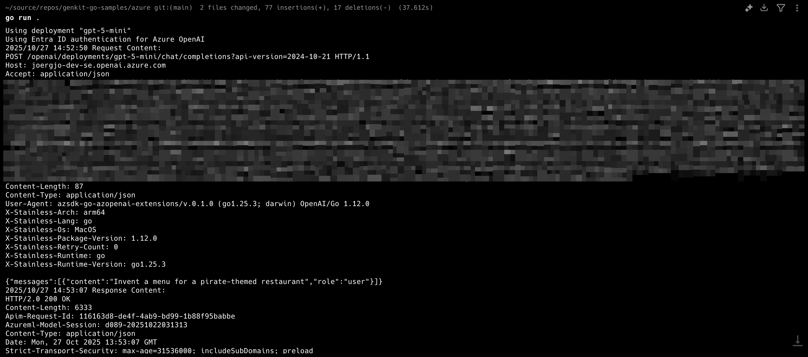
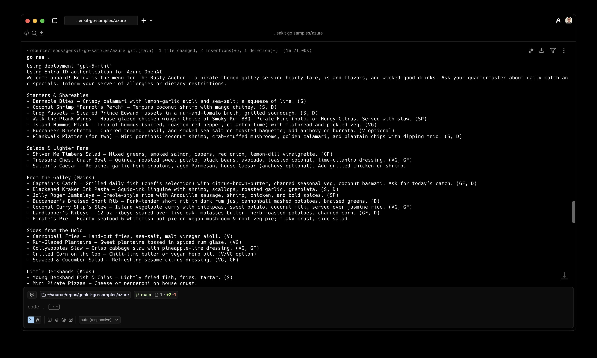

+++
date = '2025-10-27T15:32:31+02:00'
title = 'Using Genkit Go with Azure OpenAI API Version 2024-10-21'
tags = ['go', 'genkit', 'azure-openai']
series = ['Genkit Go and Azure OpenAI']
series_order = 2
summary = """In the first post of this blog series, I built an plugin for Genkit Go that support the Azure OpenAI v1. In this blog post, I'll show you how to adapt our Azure OpenAI plugin to support the still widely used API version 2024-10-21."""
+++

In the first post of this blog series, I built an Azure OpenAI plugin for Genkit Go. This implementation relied on the new Azure OpenAI `v1` API version. However, most Azure OpenAI users are likely using the previous API version `2024-10-21` because `v1` is only two months old at the time of writing. In this blog post, I'll show you how to adapt our Azure OpenAI plugin to support both `v1` and `2024-10-21`.   

## Dissecting Azure OpenAI `2024-10-21`

Let's recall from the first blog post the key differences between OpenAI (including Azure OpenAI `v1`) and `2024-10-21`:

---
When you access the model via the API, you need to refer to the deployment name rather than the underlying model name in API calls, which is one of the [**key differences** between OpenAI](https://learn.microsoft.com/en-us/azure/ai-foundry/openai/how-to/switching-endpoints) and Azure OpenAI. OpenAI only requires the model name. Azure OpenAI always requires the deployment name, even when using the model parameter.  

---

Our Azure OpenAI plugin already overrides the base URL with the correct Azure OpenAI endpoint URL and supports both Entra ID and API key authentication. 

```go {hl_lines=["18-30"]}
type AzureOpenAI struct {
	*oai.OpenAI
	APIKey          string
	TokenCredential azcore.TokenCredential
	BaseURL         string
}

func (a *AzureOpenAI) Init(ctx context.Context) []api.Action {
	if a.APIKey == "" && a.TokenCredential == nil || a.APIKey != "" && a.TokenCredential != nil {
		panic("Azure OpenAI plugin initialization failed: either APIKey or TokenCredential is required")
	}
	if a.BaseURL == "" {
		panic("Azure OpenAI plugin initialization failed: Endpoint is required")
	}

	if a.OpenAI == nil {
		// Overwrite base URL and provide API key
		a.OpenAI = &oai.OpenAI{
			APIKey: a.APIKey,
			Opts: []option.RequestOption{
				option.WithBaseURL(a.BaseURL),
			},
		}

		// If no API key is provided, use TokenCredential (Entra) for authorization
		if a.APIKey == "" {
			// Satisfy the OpenAI plugin's requirement for a non-empty string
			a.OpenAI.APIKey = "notused"
			// Inject bearer token middleware
			a.OpenAI.Opts = append(a.OpenAI.Opts, azure.WithTokenCredential(a.TokenCredential))
		}
	}

	return a.OpenAI.Init(ctx)
}
```

Reviewing the [REST API specs](https://learn.microsoft.com/en-us/azure/ai-foundry/openai/reference), we find the following discrepancies:

* The request bodies for chat completion, embeddings, and other API endpoints in Azure OpenAI `2024-10-21` do not include a `model` field like the OpenAI REST API does. As mentioned above, `model` is replaced by the deployment name, which is specified in the URL path, not the request body.
    
* The API key is sent using the custom `api-key` header, whereas OpenAI uses the standard `Authorization` header. 
    
* Azure OpenAI `2024-10-21` requires the API version to be specified via the `api-version` query string parameter.

All of these changes can be implemented by updating the `RequestOption` slice exposed by the embedded `OpenAI` plugin, as we've done previously when building our Azure OpenAI plugin.

## Adding `2024-10-21` Support to Our Azure OpenAI Plugin


The following code uses Go 1.23.5 and Genkit Go 1.1.0. Find the complete sample on [GitHub](https://github.com/joergjo/genkit-go-samples/tree/main/azure).


First, we add a field to our plugin to store the deployment name.

```go {hl_lines=6}
type AzureOpenAI struct {
	*oai.OpenAI
	APIKey          string
	TokenCredential azcore.TokenCredential
	BaseURL         string
	Deployment      string
}
```

Next, we refactor the `Init` method to more easily distinguish between the initialization logic for `v1` and `2024-10-21`.

```go {hl_lines=["10-15"]}
func (a *AzureOpenAI) Init(ctx context.Context) []api.Action {
	if a.APIKey == "" && a.TokenCredential == nil || a.APIKey != "" && a.TokenCredential != nil {
		panic("Azure OpenAI plugin initialization failed: either APIKey or TokenCredential is required")
	}
	if a.BaseURL == "" {
		panic("Azure OpenAI plugin initialization failed: Endpoint is required")
	}

	if a.OpenAI == nil {
		switch a.Deployment {
		case "":
			a.init()
		default:
			a.initWithDeployment()
		}
	}

	return a.OpenAI.Init(ctx)
}
```

The logic to support both API versions in our plugin is straightforward: If the user creates the `AzureOpenAI` plugin without setting `Deployment`, the plugin uses the `v1` API. If `Deployment` is set, the plugin uses the API version `2024-10-21`. 

Next, we add the initialization code for `v1`. It's the same as before, just extracted into a separate method.

```go
func (a *AzureOpenAI) init() {
	// Overwrite base URL and provide API key
	a.OpenAI = &oai.OpenAI{
		APIKey: a.APIKey,
		Opts: []option.RequestOption{
			option.WithBaseURL(a.BaseURL),
		},
	}

	// If no API key is provided, use TokenCredential (Entra) for authorization
	if a.APIKey == "" {
		// Satisfy the OpenAI plugin's requirement for a non-empty string
		a.OpenAI.APIKey = "notused"
		// Inject bearer token middleware
		a.OpenAI.Opts = append(a.OpenAI.Opts, azure.WithTokenCredential(a.TokenCredential))
	}
}
```

As mentioned above, the initialization logic for `2024-10-21` requires a few more changes to the `RequestOption` slice and must append the correct path with the deployment name to the base URL.

```go {hl_lines=[1, 6, "15-17", "30-32"]}
const apiVersion = "2024-10-21"

func (a *AzureOpenAI) initWithDeployment() {
	// Build the effective base URL with deployment path
	// Note: This should never fail unless BaseURL was a non-empty string that is not a valid URL
	u, err := url.JoinPath(a.BaseURL, "openai", "deployments", a.Deployment)
	if err != nil {
		panic(fmt.Sprintf("unexpected error generating base URL: %v", err))
	}

	// Overwrite base URL, set "api-version" query parameter, and remove JSON attribute "model"
	a.OpenAI = &oai.OpenAI{
		APIKey: a.APIKey,
		Opts: []option.RequestOption{
			option.WithBaseURL(u),
			option.WithQuery("api-version", apiVersion),
			option.WithJSONDel("model"),
		},
	}

	switch a.APIKey {
	case "":
		// Satisfy OpenAI's requirement for a non-empty string
		a.OpenAI.APIKey = "notused"
		// Inject bearer token middleware
		a.OpenAI.Opts = append(a.OpenAI.Opts, azure.WithTokenCredential(a.TokenCredential))

	default:
		// Use the "api-key" header instead of "Authorization"
		a.OpenAI.Opts = append(a.OpenAI.Opts,
			option.WithHeader("api-key", a.APIKey),
			option.WithHeaderDel("Authorization"))
	}
}
```

We can update or add HTTP headers, change the base URL, and even remove headers or JSON body elements using `option.WithHeaderDel` or `option.WithJSONDel`. This allows us to remove the `Authorization` header and the `model` field from the request body.


In my experience, removing the `model` field isn't strictly required—the field will be ignored by Azure OpenAI `2024-10-21`. However, I prefer to remove it since this results in cleaner requests.


With these changes, we've implemented all the necessary modifications to support Azure OpenAI `2024-10-21`! 

## Enabling HTTP Debug Logs

Before we update our sample application, I want to show you one more useful technique I use to analyze the HTTP traffic between my plugin and Azure OpenAI resources. 

We add one more `RequestOption`:

```go {hl_lines=["19-22"]}
func (a *AzureOpenAI) Init(ctx context.Context) []api.Action {
	if a.APIKey == "" && a.TokenCredential == nil || a.APIKey != "" && a.TokenCredential != nil {
		panic("Azure OpenAI plugin initialization failed: either APIKey or TokenCredential is required")
	}
	if a.BaseURL == "" {
		panic("Azure OpenAI plugin initialization failed: Endpoint is required")
	}

	if a.OpenAI == nil {
		switch a.Deployment {
		case "":
			a.init()
		default:
			a.initWithDeployment()
		}
	}

	// Enable HTTP request/response logging if AZ_OPENAI_DEBUG_HTTP environment variable is set
	debug := os.Getenv("AZ_OPENAI_DEBUG_HTTP")
	if cmp.Or(debug == "1", strings.EqualFold(debug, "true")) {
		a.OpenAI.Opts = append(a.OpenAI.Opts, option.WithDebugLog(log.Default()))
	}

	return a.OpenAI.Init(ctx)
}
```

The `option.WithDebugLog()` function allows us to specify a `*log.Logger` instance to which all HTTP requests and responses will be written. Using `log.Default()` writes these logs to `stderr`. Our code enables HTTP debug logging when the environment variable `AZ_OPENAI_DEBUG_HTTP` is set to `true`, `TRUE`, or `1`.



## A Sample Application

We can now extend our sample application to showcase the plugin for both API versions. We check for the presence of the environment variable `AZ_OPENAI_DEPLOYMENT`. If it is set, the application sets our plugin's `Deployment` field accordingly and uses Azure OpenAI `2024-10-21`. Otherwise, the sample uses `v1` as before.


```go {hl_lines=["17-31"]}
package main

import (
	"context"
	"fmt"
	"log"
	"os"

	"github.com/Azure/azure-sdk-for-go/sdk/azidentity"
	"github.com/firebase/genkit/go/ai"
	"github.com/firebase/genkit/go/genkit"
)

func main() {
	ctx := context.Background()

	baseURL := os.Getenv("AZ_OPENAI_BASE_URL")
	apiKey := os.Getenv("AZ_OPENAI_API_KEY")
	if baseURL == "" || apiKey == "" {
		log.Fatal("export AZ_OPENAI_BASE_URL and AZ_OPENAI_API_KEY to run this sample")
	}

	deployment := os.Getenv("AZ_OPENAI_DEPLOYMENT")
	modelName := "gpt-5-mini"
	switch deployment {
	case "":
		fmt.Println("AZ_OPENAI_DEPLOYMENT not set, using Azure OpenAI v1 API")
	default:
		modelName = deployment
		fmt.Printf("Using deployment %q\n", deployment)
	}

	fmt.Println("Using Entra ID authentication for Azure OpenAI")
	cred, err := azidentity.NewDefaultAzureCredential(nil)
	if err != nil {
		log.Fatalf("could not create credential: %v\n", err)
	}

	azOpenAI := &AzureOpenAI{
		BaseURL:         baseURL,
		Deployment:      deployment,
		TokenCredential: cred,
	}

	g := genkit.Init(ctx, genkit.WithPlugins(azOpenAI))
	model := azOpenAI.Model(g, modelName)

	text, err := generate(ctx, g, model, "Invent a menu for a pirate-themed restaurant")
	if err != nil {
		log.Fatalf("could not generate model response: %v\n", err)
	}
	fmt.Println(text)

	fmt.Println("")
	fmt.Println("---------------------------------------------------")
	fmt.Println("")

	fmt.Println("Using API key for Azure OpenAI")
	// We already know that the API key is not empty.
	azOpenAI = &AzureOpenAI{
		BaseURL:    baseURL,
		Deployment: deployment,
		APIKey:     apiKey,
	}
	g = genkit.Init(ctx, genkit.WithPlugins(azOpenAI))

	text, err = generate(ctx, g, model, "Invent a menu for a pirate-themed restaurant")
	if err != nil {
		log.Fatalf("could not generate model response: %v\n", err)
	}
	log.Println(text)

}

func generate(ctx context.Context, g *genkit.Genkit, model ai.Model, prompt string) (string, error) {
	// Simple chat completion
	resp, err := genkit.Generate(ctx, g,
		ai.WithPrompt(prompt),
		ai.WithModel(model))
	if err != nil {
		return "", err
	}
	return resp.Text(), nil
}
```

There is a subtle difference between using `v1` and using `2024-10-21` in the code. For `v1`, I have hardcoded the model as `gpt-5-mini`. Since a deployment in `2024-10-21` hides the actual model, you can use any model suitable for chat completion.


Export the required environment variables and run the sample.

```bash
az login
export AZ_OPENAI_BASE_URL='https://<your-resource>.openai.azure.com/'
export AZ_OPENAI_API_KEY='<your-azure-openai-api-key>'
export AZ_OPENAI_DEPLOYMENT='<your-model-deployment>'
go run .
```

Make sure to set `AZ_OPENAI_BASE_URL` without any path. The correct path is added based on your deployment name at runtime!




## Summary

This post explained how to extend our Azure OpenAI plugin for Genkit Go to support both the `v1` and `2024-10-21` API versions. By leveraging the `RequestOption` slice from the OpenAI SDK, we can customize HTTP headers, query parameters, and request bodies to accommodate the differences between the two API versions. The plugin now detects which API version to use based on whether a deployment name is provided, making it flexible for users working with either version. I also demonstrated how to enable HTTP debug logging to help troubleshoot and analyze API interactions.


